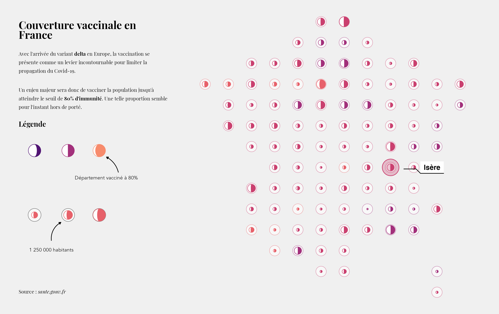

<!-- README.md is generated from README.Rmd. Please edit that file -->

```{r, include = FALSE}
knitr::opts_chunk$set(
  collapse = TRUE,
  comment = "#>"
)
```

# A map of vaccination rate per department in France

<!-- badges: start -->

<!-- badges: end -->

This demo project was mostly motivated by the desire to test the `gggibbous` R package.



The code for the map sleeps in `map.R`. The project was inspired by Cedric Scherer [2020/32 TidyTuesday contribution](https://github.com/z3tt/TidyTuesday/tree/master/plots/2020_32).
